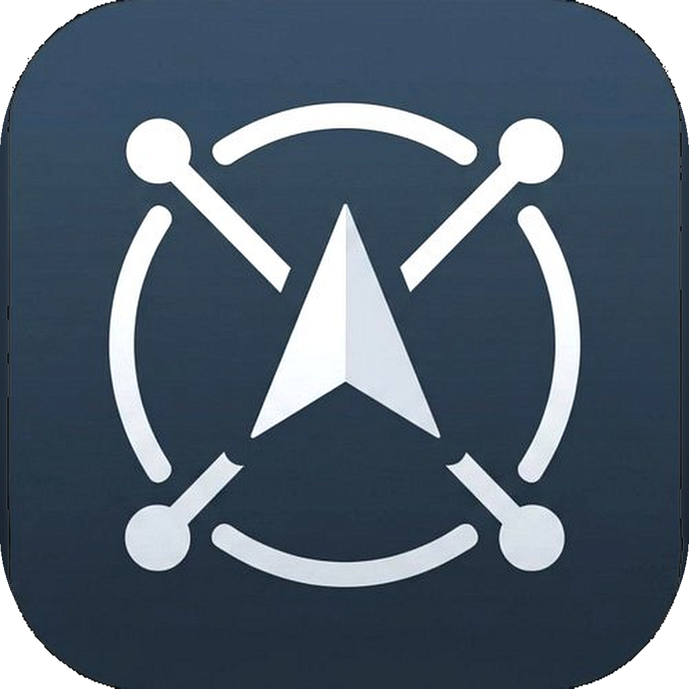

# GPSLink



[](https://developer.android.com)
[](LICENSE)
[](https://www.u-blox.com)

**GPSLink** is a high-performance Android utility that bridges external GNSS receivers (USB or Bluetooth) directly into Android's mock location provider. It enables high-precision positioning for any location-aware application—no root required.

---

## 🚀 Key Features

### 📡 Dual Connectivity
- **USB Serial (u-blox specialized)**: Native support for u-blox modules (M7-M10) with automatic configuration and binary command support.
- **Bluetooth Classic (SPP)**: Connect to any standard NMEA-compatible Bluetooth GPS/GNSS receiver.

### 📍 Mock Location Engine
- **Seamless Injection**: Feeds coordinates, altitude, speed, bearing, and accuracy into the system `LocationManager`.
- **System-Wide Compatibility**: Works with Google Maps, navigation tools, and professional surveying apps.
- **Smart Stale Detection**: Automatically flags and halts injection if the signal is lost, preventing position drift.

### 📊 Real-Time Dashboard
- **Interactive Mini-Map**: Live track visualization using OpenStreetMap (osmdroid).
- **Constellation Signal Bars**: Detailed SNR and satellite count per constellation (GPS, GLONASS, Galileo, BeiDou, QZSS, SBAS).
- **Precision Compass**: Dynamic heading needle with cardinal direction labels.
- **Collapsible Terminal**: Live NMEA sentence log with data statistics (bytes/sentences received).

### 🛠️ Advanced Configuration
- **Live Update Rates**: Switch between 1 Hz and 5 Hz on the fly (via `UBX-CFG-RATE`).
- **Auto-Connect**: Plug in a USB module to launch the app automatically.
- **Persistent Settings**: Remembers your connection type, selected Bluetooth device, and last known position.

---

## 📸 Interface Overview

| Component | Description |
| :--- | :--- |
| **Status Indicator** | Pulsating green for active data, red for errors, grey for idle. |
| **Connection Card** | Displays device model, port, baud rate, and active update frequency. |
| **GNSS Card** | High-precision Lat/Lon, Altitude (MSL), Speed (km/h), and Course. |
| **Signal Quality** | HDOP and accuracy (±m) metrics updated per second. |
| **Satellite Cards** | Separate tracking for "In View" vs "In Use" satellites. |
| **Mock Warnings** | In-app alerts if "Mock Location App" is not configured in Developer Options. |

---

## 🔌 Supported Hardware

### USB Receivers
Supports any u-blox receiver with USB VID `0x1546`:
- **u-blox M10 / M9 / M8 / M7**
- Generic u-blox fallback for unknown product IDs.

### Bluetooth Receivers
- Any receiver supporting the **Bluetooth Serial Port Profile (SPP)**.
- Common models: Bad Elf, Dual XGPS, Garmin GLO, and generic SPP modules (HC-05/06).

---

## ⚙️ Setup Guide

1.  **Enable Developer Options**: Go to `Settings > About Phone` and tap `Build Number` 7 times.
2.  **Configure Mock Location**: In `Developer Options`, set **GPSLink** as the "Mock location app".
3.  **Grant Permissions**: Accept **Precise Location** and **Nearby Devices** (for Bluetooth) permissions.
4.  **Connect & Start**:
    - **USB**: Connect via OTG cable; the app will prompt for permission.
    - **Bluetooth**: Pair your device in Android settings, select it in GPSLink, and tap **Start**.

---

## 🏗️ Project Architecture

```
app/src/main/java/com/gpslink/
├── MainActivity.java         # Central UI controller and state management
├── UsbSerialService.java     # Foreground service for USB-based GNSS
├── BluetoothGpsService.java  # Foreground service for Bluetooth GNSS
├── NmeaParser.java           # Multi-constellation NMEA 0183 parsing engine
├── MiniMapView.java          # Real-time OSM path tracking component
├── CompassView.java          # Custom bearing visualization
└── SignalBarsView.java       # Constellation-specific SNR charts
```

---

## 🛠️ Building

**Requirements:**
- Android Studio Ladybug+
- JDK 17
- Android SDK 34 (API 34)

```bash
# Clone and build via Gradle
./gradlew assembleDebug
```

---

## 📄 License

Distributed under the MIT License. See `LICENSE` for more information.

---

<p align="center">
  Developed with ❤️ for the GNSS Community
</p>

<br>
